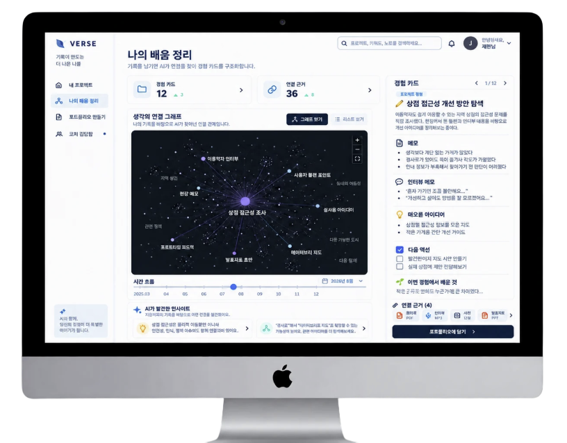

# 👾 RE:Cord
---
> **오늘의 경험을, 내일의 가능성으로.**  
> 대안학교 학생의 경험과 근거를 연결해, 지금 필요한 기록과 다음 준비 방향을 안내하는 웹서비스


## 👨‍💻 About our team
---
> 2026년 2학기 오픈소스소프트웨어프로젝트 4팀 RE.VERSE
*개발 기간: 2026.09 ~ 2026.12*

| 역할 | 이름 | 학과 |
| --- | --- | --- |
| 팀장 | 임여민 | 철학과 |
| 팀원 | 이영민 | 건축학과 |
| 팀원 | 정재윤 | 국제통상학과 |
| 팀원 | 조현서 | 통계학과 |

## 🕹️ 주요 기능
---
### 내 프로젝트



### 📁 내 프로젝트
프로젝트별로 회의록, 회고, 사진, 결과물 등 활동 과정에서 생성된 자료를 등록하고 관리합니다.  
흩어져 있던 기록을 하나의 프로젝트 단위로 모아 경험을 지속적으로 축적할 수 있습니다.

### 🔗 나의 경험 관리
프로젝트 기록에서 역할, 문제 해결 과정, 결과, 회고 등의 주요 경험을 구조화하고 서로 연결합니다.  
부족한 기록이나 추가로 남겨두면 좋은 내용을 안내하며, 경험 간 관계를 그래프 형태로 확인할 수 있습니다.

### 📄 포트폴리오 만들기
축적된 프로젝트 경험 중 목적에 맞는 내용을 선택해 포트폴리오로 구성합니다.  
기존 기록을 기반으로 작성 가이드와 기본 초안을 제공하고, 사용자가 직접 수정·보완하여 완성할 수 있습니다.

## 설치 및 실행
---
Git이 설치된 macOS 터미널 또는 Windows Git Bash에서 저장소를 내려받습니다.

```bash
git clone https://github.com/CSID-DGU/2026-2-OSSProj-RE.VERSE-04.git
cd 2026-2-OSSProj-RE.VERSE-04
```

현재는 기획·설계 문서 단계로, 실행 가능한 애플리케이션과 배포 주소는 아직 없습니다. 의존성 설치, 환경 설정, 실행·테스트 명령어는 소스코드와 개발환경이 확정된 뒤 추가합니다.

## 프로젝트 관리 문서

| 문서 | 상태 |
| --- | --- |
| [회의록](./Doc/4_1_OSSProj_04_REVERSE_회의록.pdf) | 매 발표 시 갱신 |


## 변경 이력 및 라이선스

**2026.09.29** — README와 제품 구성·배포·운영 계획 초안 작성.  
**라이선스** — 팀 협의 후 확정하여 안내할 예정입니다
